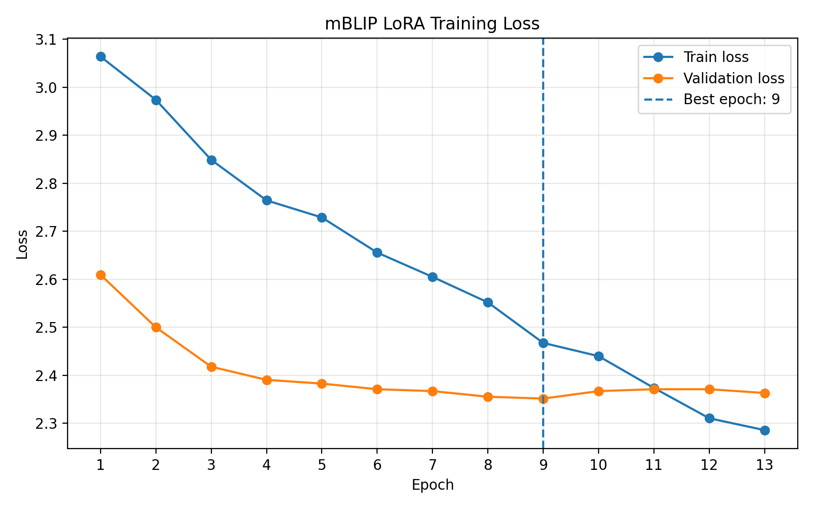
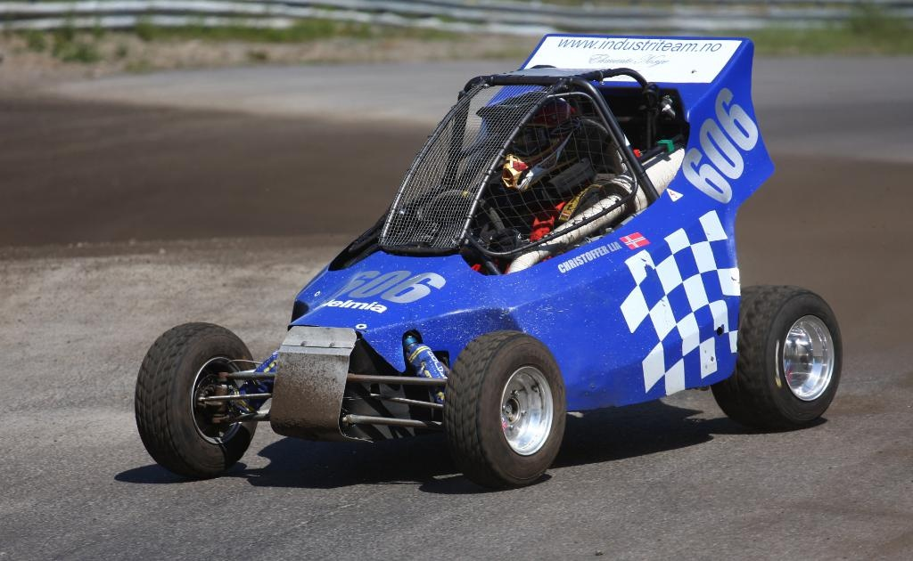

# BLIP Lithuanian Captioning

This project explores fine-tuning a multilingual vision–language model for image captioning in Lithuanian, a low-resource language.

The goal is to create a custom Lithuanian caption dataset and adapt a pretrained model to generate captions that better match the dataset style.

The task was to:

- create a small, original dataset in a non-dominant language (Lithuanian)
- fine-tune a pretrained vision–language model (BLIP)
- evaluate how fine-tuning affects model behavior

---

## Dataset

Source: OpenImages V7
https://storage.googleapis.com/openimages/web/index.html.

The images were randomly selected with different content.

Annotation flow:

1. Each image was first described in the annotator’s native language.
2. The description was then translated into Lithuanian.
3. Captions were simplified to short, natural descriptions.

All created annotations is kept in data/annotations.csv

Splitting with 200/30/30 proportion for train/validation/test.

---

## Model

### mBLIP

The project uses: `Gregor/mblip-mt0-xl` - this is a multilingual vision–language model (mBLIP) capable of generating captions in multiple languages, including Lithuanian.

Total parameters: ~4.8B
Trainable parameters (LoRA): ~4.7M (~0.1%) with following config:
```python
LoraConfig(
    r=8,
    lora_alpha=16,
    lora_dropout=0.05,
    bias="none",
    target_modules=["q", "v"],
)
```

### Gemma 4 E4B-it

An additional comparison was performed using `Gemma 4 E4B-it`, an instruction-tuned vision-language model.

Total parameters: ~8.0B

For fine-tuning, LoRA adapters were applied only to the attention projection layers.

Trainable parameters (LoRA): ~1.8M (~0.02%) with following config:

```python
target_modules=["q_proj", "v_proj"]

r=4
lora_alpha=8
lora_dropout=0.05

finetune_vision_layers=False
finetune_language_layers=True
finetune_attention_modules=True
finetune_mlp_modules=False
```

---

## Training 

General Setup:

| Parameter      | Value             |
|----------------|-------------------|
| Epochs         | 20                |
| Batch size     | 8                 |
| Learning rate  | 1e-4              |
| Optimizer      | AdamW             |
| Scheduler      | ReduceLROnPlateau |
| Early stopping | yes               |

The key idea for using LoRA is to inject small trainable matrices into selected layers instead of fine-tuning all model weights. This significantly reduces the number of trainable parameters and computational requirements while preserving most of the pretrained model knowledge.

Training procedure:

1. During each training run, the best checkpoint was selected based on validation loss.
2. Early stopping was used to reduce overfitting.
3. Each experiment stored LoRA weights in a separate output directory.
4. The final mBLIP experiment was selected based on BLEU-4 score on the test set.

## Evaluation

The model was evaluated using several complementary metrics:

### 1. BLEU Score

Measures n-gram overlap between generated captions and reference Lithuanian captions.

Used for:
- baseline vs fine-tuned comparison

---

### 2. chrF Score

Measures overlap between reference and generated captions using character n-grams.

Unlike BLEU, chrF is less sensitive to exact word forms and is often considered more suitable for morphologically rich languages such as Lithuanian.

Used for:
- baseline vs fine-tuned comparison
- evaluation of lexical similarity between captions

---

### 3. Semantic Similarity

Computed using:
`sentence-transformers/paraphrase-multilingual-MiniLM-L12-v2`

Measures cosine similarity between:
- reference caption
- generated caption

This metric captures **semantic similarity**, even when wording differs.

---

### 4. CLIP Score

Computed using:
`openai/clip-vit-base-patch32`

Measures cosine similarity between:
- image embedding
- caption embedding

Used as a proxy for **image-text alignment**.

Note:
CLIP is primarily trained on English data, so this metric is considered auxiliary for Lithuanian captions.

---

### 5. Qualitative Evaluation

Several examples were manually inspected to compare:
- reference captions
- baseline outputs
- fine-tuned outputs


---

## Results

### Experiments

Several LoRA fine-tuning experiments were tested with different batch sizes, learning rates, LoRA ranks, LoRA dropout values, and target modules.

| Experiment       | Epochs  | Batch size  | LR   | LoRA (r, alpha, dropout) | BLEU-4     |
|------------------|---------|-------------|------|--------------------------|------------|
| Baseline (mBLIP) | –       | –           | –    | –                        | 0.0093     |
| Exp1 (test run)  | 5       | 1           | 1e-5 | (8,16,0.05)              | 0.0093     |
| Exp2             | 10      | 1           | 3e-5 | (8,16,0.05)              | 0.0136     |
| Exp3             | 15      | 2           | 5e-5 | (8,16,0.05)              | 0.0216     |
| Exp4             | 20      | 4           | 1e-4 | (8,16,0.05)              | 0.0203     |
| Exp5             | 20      | 8           | 1e-3 | (8,16,0.05)              | 0.0204     |
| Exp6             | 20      | 8           | 1e-4 | (8,16,0.05)              | **0.0243** |
| Exp7             | 20      | 8           | 1e-4 | (16,32,0.05)             | 0.0165     |
| Exp8             | 20      | 8           | 1e-4 | (8,16,0.10)              | 0.0194     |
| Exp9             | 20      | 8           | 1e-4 | (8,8,0.15)               | 0.0174     |


- Increasing batch size significantly improved performance (makes training more stable)
- Moderate LoRA configuration (r=8, alpha=16) worked well
- Larger LoRA (r=16) degraded performance (siignificantly increasing the total amount of trained parameters), likely due to overfitting
- Higher dropout also reduced performance
- The best results were achieved with a simple and stable configuration

Training curve:




The final model from the 6th experoment was selected based on the highest BLEU-4 score on the test set.

The validation loss reached the best value around epoch 9, after which early stopping and the learning rate scheduler helped prevent further overfitting.

### Gemma 4 Comparison Experiments

In addition to mBLIP, several LoRA fine-tuning experiments were performed with `unsloth/gemma-4-E4B-it` in order to compare the selected multilingual captioning model with a general instruction-tuned vision–language model.

The Gemma experiments used the same train/validation/test split. Unlike the first exploratory Gemma run, the experiments below used the validation set during training for evaluation and checkpoint selection.

| Experiment   | LoRA target modules    | LoRA (r, alpha, dropout) | LR   | Epochs | Steps | BLEU-1 | BLEU-2 | BLEU-3 | BLEU-4 | chrF      | SemSim     | CLIPScore  |
|--------------|------------------------|--------------------------|------|--------|-------|--------|--------|--------|--------|-----------|------------|------------|
| Gemma 4 Base | –                      | –                        | –    | –      | –     | 0.0384 | 0.0131 | 0.0083 | 0.0068 | **23.15** | **0.6063** | **0.2167** |
| Gemma 4 Exp2 | q_proj, v_proj         | (4, 8, 0.05)             | 2e-5 | 3      | 150   | 0.0363 | 0.0101 | 0.0069 | 0.0059 | 22.67     | 0.6003     | 0.2126     |
| Gemma 4 Exp3 | q_proj, v_proj         | (8, 16, 0.05)            | 5e-5 | 3      | 150   | 0.0369 | 0.0117 | 0.0073 | 0.0060 | 21.75     | 0.6019     | 0.2108     |
| Gemma 4 Exp4 | q_proj, v_proj, rsLoRA | (8, 16, 0.10)            | 5e-5 | 5      | 250   | 0.0307 | 0.0089 | 0.0061 | 0.0052 | 21.31     | 0.5868     | 0.2108     |

Gemma Exp1 was excluded from the main comparison because it did not use the validation set during training. It is treated as an exploratory run rather than a directly comparable experiment.

The Gemma experiments did not show consistent improvement after fine-tuning. Reducing LoRA capacity preserved semantic similarity and image-text alignment better, but did not improve BLEU. The more aggressive LoRA configurations slightly improved BLEU scores in some cases, but these changes were not accompanied by improvements in Semantic Similarity or CLIPScore.

---

### Quantitative Comparison

The final quantitative comparison includes the selected mBLIP model and the best comparable Gemma run trained with validation-based checkpoint selection. Exp2 was selected because it used the most conservative LoRA configuration and preserved semantic similarity and CLIPScore most consistently across metrics.

| Model             | BLEU-1     | BLEU-2     | BLEU-3     | BLEU-4     | chrF      | Semantic similarity | CLIPScore  |
|-------------------|------------|------------|------------|------------|-----------|---------------------|------------|
| mBLIP Base        | 0.0460     | 0.0141     | 0.0103     | 0.0093     | 18.99     | 0.5175              | 0.2108     |
| mBLIP LoRA Exp6   | **0.1107** | **0.0478** | **0.0281** | **0.0243** | **24.17** | 0.5695              | 0.2086     |
| Gemma 4 Base      | 0.0384     | 0.0131     | 0.0083     | 0.0068     | 23.15     | **0.6063**          | **0.2167** |
| Gemma 4 LoRA Exp2 | 0.0363     | 0.0101     | 0.0069     | 0.0059     | 22.67     | 0.6003              | 0.2126     |

Reference CLIP score for mBLIP evaluation: 0.2128.

---

## Qualitative Examples

The following examples compare the reference caption, the original model output, the fine-tuned model output, and the Gemma 4 comparison output. Per-image metrics are shown for the generated captions.

### Example 1

<table>
<tr>
<td width="35%">

</td>
<td width="65%">

**Reference:**  
Gatvė šalia senovinio pastato su bokštais.

| Model             | Prediction                                                                                                                         |
|-------------------|------------------------------------------------------------------------------------------------------------------------------------|
| mBLIP Base        | automobilis, važiuojantis gatvėje šalia tvirtovės                                                                                  |
| mBLIP LoRA Exp6   | Istorinis pastatas gatvėje su automobiliu.                                                                                         |
| Gemma 4 Base      | Šiame pieseje matyti senas, kalejinis stilius, pilis, šalia kurio yra modernus pastatas, o gatvėje važiuoja automobilis.           |
| Gemma 4 LoRA Exp2 | Šiame pieseje matyti senas, fortifikacijos stiliaus pastatas, esantis miežio aplinkoje, su šaliai esančia modernia pastatų dalimi. |

| Model             | Semantic similarity | CLIPScore |
|-------------------|---------------------|-----------|
| mBLIP Base        | 0.5468              | 0.2326    |
| mBLIP LoRA Exp6   | 0.8213              | 0.1951    |
| Gemma 4 Base      | 0.8295              | 0.2247    |
| Gemma 4 LoRA Exp2 | 0.6771              | 0.2435    |

Reference CLIPScore: `0.2154`

</td>
</tr>
</table>

### Example 2

<table>
<tr>
<td width="35%">

</td>
<td width="65%">

**Reference:**  
Prie stalo sėdinti moteris su oro balionais.

| Model             | Prediction                                                       |
|-------------------|------------------------------------------------------------------|
| mBLIP Base        | Žmogus sėdi ant stalo su baltomis ir baltomis balionais.         |
| mBLIP LoRA Exp6   | Jauna moteris prie stalo su balionais.                           |
| Gemma 4 Base      | Moteris sėdi prie stalo, pasimylėusi, ir šalia jos yra balionai. |
| Gemma 4 LoRA Exp2 | Moteris sėdi prie stalo, pasiklausyusi balionų.                  |

| Model             | Semantic similarity | CLIPScore |
|-------------------|---------------------|-----------|
| mBLIP Base        | 0.7491              | 0.1679    |
| mBLIP LoRA Exp6   | 0.9125              | 0.1806    |
| Gemma 4 Base      | 0.9371              | 0.1739    |
| Gemma 4 LoRA Exp2 | 0.9263              | 0.1662    |

Reference CLIPScore: `0.1700`

</td>
</tr>
</table>

### Example 3

<table>
<tr>
<td width="35%">

</td>
<td width="65%">

**Reference:**  
Lenktyninis kartas trasoje važiavimo metu.

| Model             | Prediction                                                                                                |
|-------------------|-----------------------------------------------------------------------------------------------------------|
| mBLIP Base        | Žmogus, važiuojantis mėlynos spalvos automobiliu.                                                         |
| mBLIP LoRA Exp6   | Autosporto dalyvis, važiuojantis gatve.                                                                   |
| Gemma 4 Base      | Šiame vaizde matomas mėlynas, sportinis, dviračioje judantis automobilis, kuris yra paruoštas užklausoms. |
| Gemma 4 LoRA Exp2 | Šiame vaizde matomas mėlynas, sportinis, dviračioje judantis automobilis, kuris yra paruoštas užklausoms. |

| Model             | Semantic similarity | CLIPScore |
|-------------------|---------------------|-----------|
| mBLIP Base        | 0.4112              | 0.2208    |
| mBLIP LoRA Exp6   | 0.5920              | 0.2530    |
| Gemma 4 Base      | 0.4430              | 0.2289    |
| Gemma 4 LoRA Exp2 | 0.4430              | 0.2289    |

Reference CLIPScore: `0.2093`

</td>
</tr>
</table>

---
### Observations

- mBLIP benefited clearly from LoRA fine-tuning: BLEU, chrF, and Semantic Similarity increased substantially.
- Gemma 4 produced relatively strong Lithuanian captions even without fine-tuning.
- Multiple LoRA configurations were evaluated for Gemma 4, but none produced consistent improvements across BLEU, chrF, Semantic Similarity, and CLIPScore.
- Gemma 4 achieved higher Semantic Similarity scores than mBLIP in both baseline and fine-tuned configurations, indicating stronger zero-shot Lithuanian captioning ability.
- CLIPScore remained relatively stable for both models after fine-tuning.

## Interpretation

The results show that fine-tuning improved the model's ability to generate captions that are semantically closer to the Lithuanian reference descriptions (which I created in the preparation stage).

However, CLIP score slightly decreased, indicating that generated captions became less aligned with image content according to the CLIP model.

This can be explained by:

- The dataset contains short and simplified captions
- The baseline model generates longer and more descriptive outputs
- CLIP favors more descriptive (often English-like) captions

Therefore, fine-tuning primarily resulted in **style adaptation** rather than improved image understanding.

The comparison with Gemma 4 revealed a different behavior. Gemma 4 already generated fluent Lithuanian captions before fine-tuning, indicating strong multilingual capabilities acquired during pretraining.

Several LoRA configurations were evaluated, including different ranks, learning rates, dropout values, and target modules. Although training and validation losses decreased during optimization, these improvements did not consistently translate into better performance on the held-out test set.

This suggests that the selected LoRA configurations and the available dataset size were not sufficient to produce measurable improvements for Gemma 4.

## Conclusion

This project demonstrates that fine-tuning a multilingual vision–language model on a small Lithuanian dataset leads to:

- Improved alignment with dataset-specific caption style
- Increased semantic similarity to reference captions
- Insignificant degradation in CLIP-based image-text alignment

The results suggest that both evaluated models already possessed multilingual capabilities before fine-tuning. The primary effect of fine-tuning was not teaching a new language, but adapting the generated captions to the style and vocabulary of the custom Lithuanian dataset.
This is consistent with the behavior of large pretrained models when trained on small datasets.

An additional comparison was performed using Gemma 4 E4B-it, a larger instruction-tuned vision-language model.

Unlike mBLIP, Gemma 4 already demonstrated strong Lithuanian captioning capabilities before fine-tuning, achieving higher Semantic Similarity scores than the mBLIP baseline.

However, multiple LoRA fine-tuning experiments did not produce consistent improvements on the test set. While Gemma 4 showed strong zero-shot performance, mBLIP responded much better to fine-tuning and achieved larger gains across BLEU, chrF, and Semantic Similarity metrics.

The comparison with Gemma 4 demonstrated that stronger zero-shot performance does not necessarily imply better adaptation on a very small dataset. While Gemma 4 produced semantically strong Lithuanian captions without additional training, LoRA fine-tuning did not provide measurable improvements. In contrast, mBLIP showed lower baseline performance but responded more effectively to fine-tuning.
